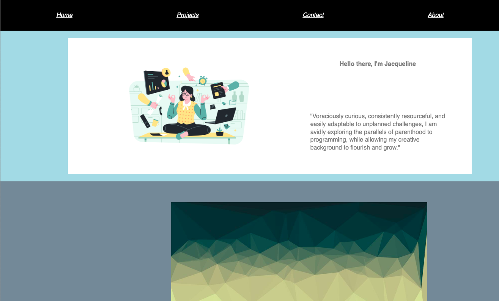
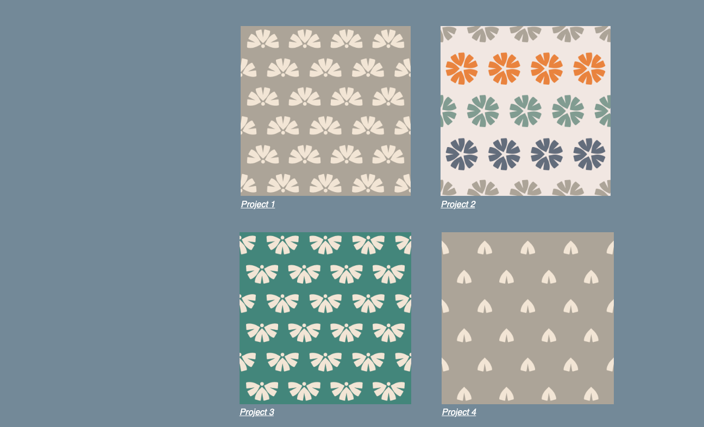
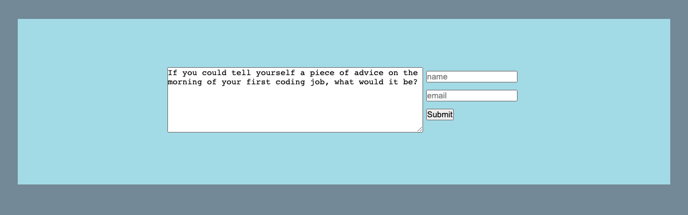

# Challenge-2-UTBC

**Portfolio Landing Page**

This repository is used as the first-impression for employers and peers to view skills, previous work, and proper communication resources.

---

[Deployed App](https://github.com/jackieAmartinez/LP-Portfolio.git)

Assitance provided by: Matt Montiel - Vincent Richards - Jenny Trevizo

Image attribution: WowPatterns.com, DrawKit.com
